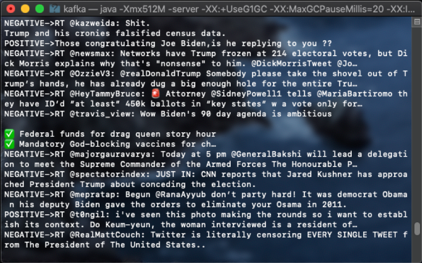
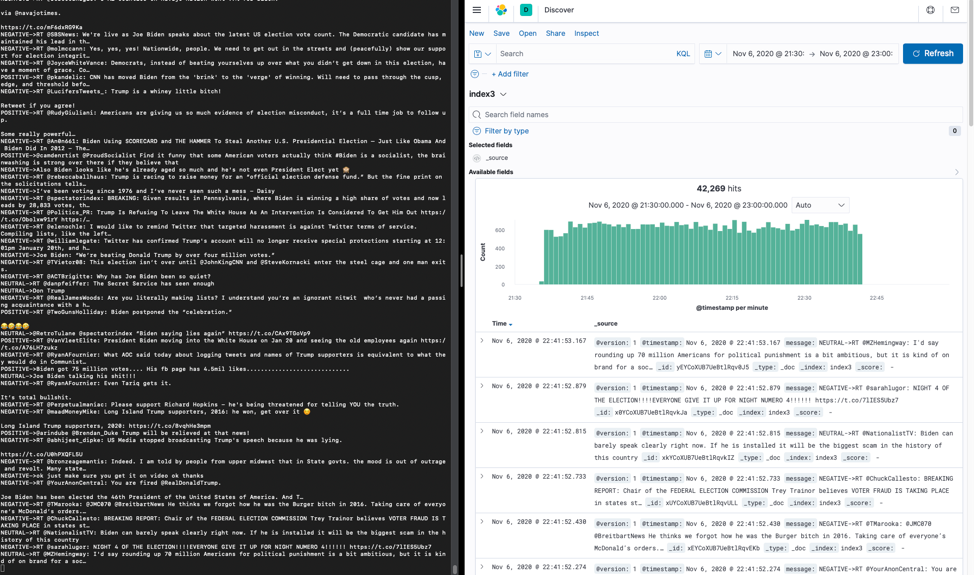
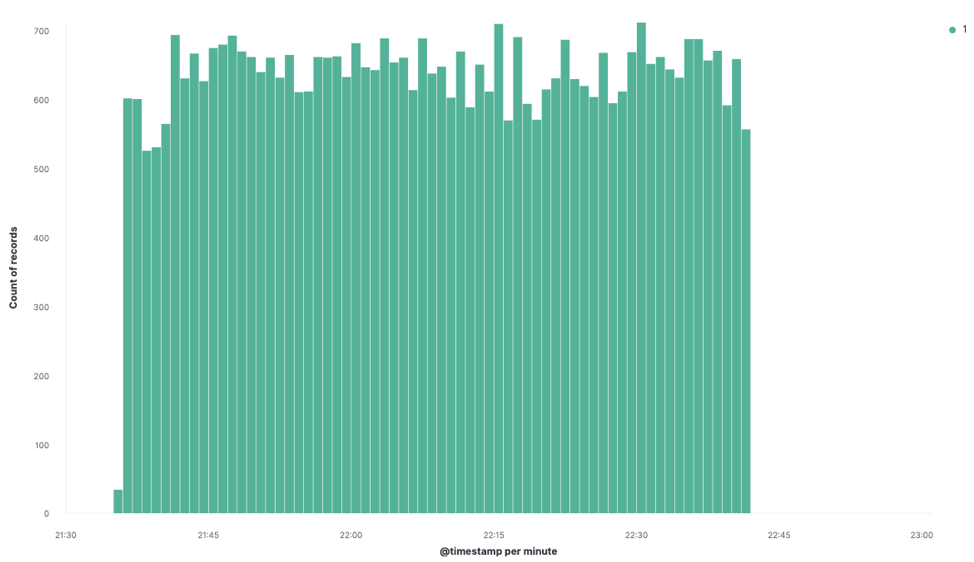
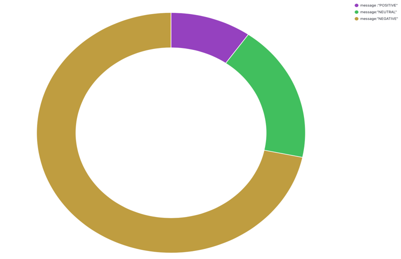
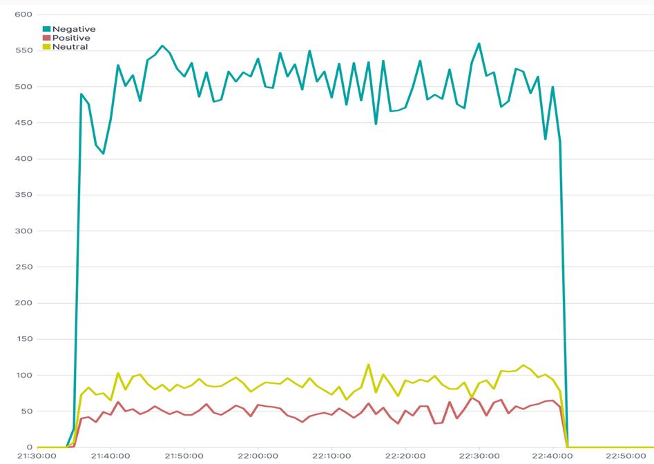

# *Spark Streaming with Twitter and Kafka*

## Requirements

1.	Java		(v1.8.0_261)
2.	Scala		(v2.11.8)
3.	Spark		(2.4.0)
4.	sbt
5.	Kafka		(v2.11-2.4.0)
6.	Elastic Search	(v7.9.3)
7.	Kibana		(v7.9.3-darwin-x86_64)
8.	Logstash	(v7.9.3)

# Execution

Tweets are streamed using Kafka into Scala project where tweets are analyzed for their sentiment using Stanford NLP library. Results of sentiment analysis are classified as POSITIVE, NEGATIVE or NEUTRAL. A message containing the sentiment is sent back to the kafka through topicA and they are visualized using Kibana and Elasticsearch. The keywords searched are “Biden”, “Trump” and “election”.

## How to Implement

The following instructions are for Linux/MacOS.

Assumptions: All the required tools (sbt, elasticsearch, kafka, kibana and logstash) are downloaded and twitter developer account is created.

To run the project, download the folder and in the terminal follow the steps:

<ins>STEP 1:</ins>
Change direction (cd) to Kafka folder and start the zookeeper server by running the following command:
sh bin/zookeeper-server-start.sh config/zookeeper.properties

<ins>STEP 2:</ins>
In another terminal, cd to Kafka folder and run the Kafka server like following:
sh bin/kafka-server-start.sh config/server.properties

<ins>STEP 3:</ins>
In another terminal, cd to Kafka folder and create a topic.
sh bin/kafka-topics.sh --create --bootstrap-server localhost:9092 --replication-factor 1 --partitions 1 --topic topicA

<ins>STEP 4:</ins>
Now, start Kafka consumer and check connection logs.
sh bin/kafka-console-consumer.sh --bootstrap-server localhost:9092 --topic topicA --from-beginning

<ins>STEP 5:</ins>
Now cd to elasticsearch/bin and start the server.
./elasticsearch
localhost:9200 is now running.

<ins>STP 6:</ins>
Now run the Kibana server by cd to kibana/bin.
./kibana 
localhost:5601 is now working. On the localhost, go to the dev tools and run 
GET /_cat/health?v&pretty
Ideally, cluster health should be at 100%.

<ins>STEP 7:</ins>
Logstash configuration is created as ‘logstash-simple.conf’ and located in the project (kafka) folder. To load the configuration, copy the path of the project and cd to logstach/bin and run
./logstash -f pathToProject/logstash-simple.conf
logstash-simple.conf configuration is as follows:
input { kafka { bootstrap_servers => "localhost:9092" topics => ["topicA"] } } output { elasticsearch { hosts => ["localhost:9200"] index => "index3" } } 

<ins>STEP 8:</ins>
Now create the fat jar using sbt by cd to the project (kafka) folder and running:
sbt assembly
Jar is created at pathToProject/target/scala-2.11/kafka-assembly-0.1.jar 
Project is now compiled

<ins>STEP 9:</ins>
Now run the compiled project as following:
spark-submit --packages org.apache.spark:spark-sql-kafka-0-10_2.11:2.4.6 --class TwitterSentimentAnalysis pathToProject/target/scala-2.11/kafka-assembly-0.1.jar topicA accessKey secretKey tokenAccessKey tokenSecretKey
Where
pathToProject is your path where project is downloaded and
accessKey, secretKey, tokenAccessKey, tokenSecretKey are keys from your twitter developer account.

<ins>STEP 10:</ins>
Once the project is running and data is streaming, go to localhost:5601 and create an index ‘index3’. Once the index is created, you can see the data incoming in the ‘discovery’ section and create various visualisations.
<ins>Note:</ins>
If you are not able to create an index because of a server error, copy paste the following two lines in the same sequence in a new terminal window while the project is still running.

curl -XPUT -H "Content-Type: application/json" http://localhost:9200/_cluster/settings -d '{ "transient": { "cluster.routing.allocation.disk.threshold_enabled": false } }'

curl -XPUT -H "Content-Type: application/json" http://localhost:9200/_all/_settings -d '{"index.blocks.read_only_allow_delete": null}'

Now, try creating index again.

# Visualization

Analyzed data is read by consumer and is being checked for consumer logs.

Data from consumer log in Kibana ‘discovery’ looks like:

coming in at about 650 tweets on average per minute for our keywords.

The following pie chart shows the tweet counts based on the classification.

The following timelion graph shows classification of tweets by count per minute.

